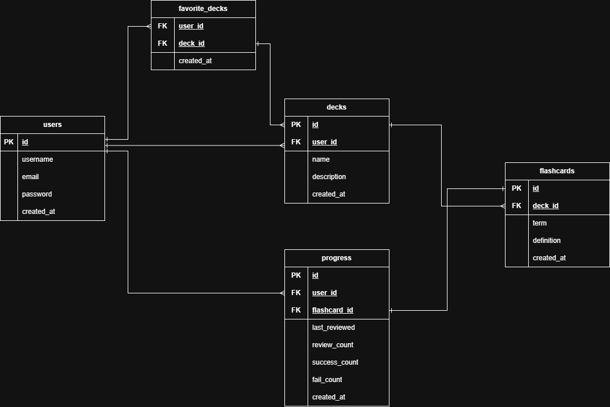

# Remind Flashcards App

A full-stack flashcard learning application allowing users to create, manage, and study custom decks. Containerized with Docker for easy setup and deployment.

---

## Project Description

Remind is a flashcard-based learning app designed to help users retain information through spaced repetition. It is designed for learners who want an efficient and easy way to review and memorize content. This application supports user authentication, personalized deck creation, flashcard studying, and tracking learning progress.

The project is implemented as a containerized full-stack web app:

-   **Backend**: RESTful API built with Node.js, Express, PostgreSQL, Prisma, and JWT-based authentication.
-   **Frontend**: Built using React, Vite, and Tailwind CSS. Features include route protection, responsive design, and a simple study interface optimized for usability.
-   **Infrastructure**: Dockerized services orchestrated via Docker Compose. Includes PostgreSQL, RabbitMQ for background processing, and a dedicated worker container for asynchronous tasks.

---

## Key Features

-   JWT-based authentication using access and refresh tokens
-   Secure user registration, login, logout, and session handling
-   Full CRUD functionality for flashcard decks and individual cards
-   Interactive study mode with real-time progress tracking
-   Background CSV import handled by asynchronous job processing
-   API documentation available through integrated Swagger UI at `/api/docs`

---

## Database Schema



---

## Setup Instructions

### Prerequisites

-   [Docker](https://www.docker.com/) & [Docker Compose](https://docs.docker.com/compose/)
-   Free ports: `5173` (frontend), `8080` (backend)

### 1. Clone the repository:

Open your terminal or command prompt.
Use Git to clone the project repository to your local machine.

```bash
git clone github.com/bargiee/ztpai.git
cd ztpai  # Navigate into the project directory
```

### 2. Configure Environment Variables

Create a `.env` file inside the `backend` directory with the following content:

```env
PORT=8080
DATABASE_URL="postgresql://myuser:mypassword@db:5432/mydatabase"

JWT_SECRET="your_access_secret"
JWT_EXPIRES_IN=1800 # 30 minutes

JWT_REFRESH_SECRET="your_refresh_secret"
JWT_REFRESH_EXPIRES_IN=604800 # 7 days
```

### 3. Build and Run the Application

From the root of the project directory:

```bash
docker compose up -d --build
```

Initialize the database using Prisma:

```bash
docker compose exec backend npx prisma generate
docker compose exec backend npx prisma migrate deploy
```

Rebuild the backend container:

```bash
docker compose up -d --build backend
```

Then access:

-   Frontend: [http://localhost:5173](http://localhost:5173)
-   Backend API: [http://localhost:8080/api](http://localhost:8080/api)
-   Swagger UI: [http://localhost:8080/api/docs](http://localhost:8080/api/docs)
-   RabbitMQ Dashboard: [http://localhost:15672](http://localhost:15672) — Login: `guest` / `guest`

---

## Technologies Used

-   **Node.js**

    -   A JavaScript runtime environment for executing server-side code.
    -   Its non-blocking, event-driven architecture makes it efficient for handling many requests at once. It is widely used and helps build scalable backend applications.

-   **Express**

    -   A fast and minimalist web framework for Node.js.
    -   Provides essential HTTP methods, middleware support, and routing tools, making backend development structured and productive.

-   **PostgreSQL**

    -   A powerful, open-source object-relational database system.
    -   Reliable, ACID-compliant, and well-supported in ORMs like Prisma. Suitable for structured data and relational queries.

-   **Prisma**

    -   A type-safe ORM for Node.js and TypeScript.
    -   Helps with database modeling and migrations, improves developer productivity, and prevents runtime errors through static typing.

-   **React**

    -   A JavaScript library for building user interfaces.
    -   Encourages reusable components and supports reactive UIs, helping deliver smooth, maintainable frontend experiences.

-   **Tailwind CSS**

    -   A utility-first CSS framework.
    -   Enables fast UI development with predefined classes, promotes design consistency, and avoids unnecessary complexity in stylesheets.

-   **Docker & Docker Compose**

    -   Tools for containerizing and orchestrating application services.
    -   Docker Compose simplifies running the application by defining all services in a single configuration file. It ensures consistent environments, streamlines setup, and makes managing dependencies and updates more efficient.

---

## Additional Notes

-   **API Documentation**

    -   Generated using Swagger (OpenAPI).
    -   Contains complete reference details for endpoints, parameters, request/response bodies, and auth requirements.
    -   Accessible at [http://localhost:8080/api/docs](http://localhost:8080/api/docs) while the app is running.

-   **RabbitMQ**

    -   Used for handling asynchronous CSV import jobs to prevent API delays.
    -   Management UI available at [http://localhost:15672](http://localhost:15672) — login using `guest` / `guest`.
